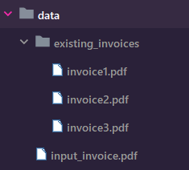

# Document-Similarity-Matching

## Overview
This project aims to develop a system that identifies and matches similar invoices based on their content and structure. The system categorizes incoming invoices by comparing them to existing templates or previously processed invoices.

## Table of Contents
1. [Project Structure](#project-structure)
2. [Setup](#setup)
3. [Implementation Details](#implementation-details)
   - [Document Representation](#document-representation)
   - [Feature Extraction](#feature-extraction)
   - [Similarity Calculation](#similarity-calculation)
   - [Database Integration](#database-integration)
4. [How to Run](#how-to-run)
5. [Results](#results)
6. [Screenshots](#screenshots)
7. [Libraries Used](#libraries-used)
8. [Author](#author)


## Project Structure
```doctest
                 
Document Similarity Matching
├── data
│   ├── existing_invoices       # Folder for storing existing invoices in PDF format
│   └── input_invoice.pdf       # Input invoice to be matched
├── src
│   ├── __init__.py             # Makes src a package
│   ├── text_extraction.py      # Code for extracting text from PDFs
│   ├── feature_extraction.py   # Code for extracting features from text
│   ├── similarity.py           # Code for calculating similarity between invoices
│   ├── database.py             # Code for in-memory database integration
│   └── main.py                 # Main script to run the program
├── requirements.txt            # List of dependencies
├── README.md                   # Documentation
└── results_video.mp4           # Screen recording of the demo

```


## Setup
1. Install Python 3.x.
2. Install required libraries:
```bash
   pip install -r requirements.txt
```
## Implementation Details
### Document Representation
Invoices are represented by extracting their text content and relevant features. Two methods for text extraction are provided:

* extract_text_pypdf2: Uses the PyPDF2 library to extract text from PDFs.
* extract_text_tika: Uses the Tika library to extract text from PDFs.

### Feature Extraction
Features from the text are extracted to identify key elements:

* extract_features: Extracts keywords from the text.
* extract_important_features: Extracts specific features such as invoice numbers, dates, and amounts, and uses 
 *  extract_features to get keywords.

## Similarity Calculation
The system uses the following similarity metrics to compare invoices:

- Cosine Similarity: Calculated using TF-IDF vectorization (cosine_similarity_text function).
- Jaccard Similarity: Measures the overlap between sets of keywords (jaccard_similarity function).

## Database Integration
An in-memory database is used to store and retrieve invoice features:

- add_to_database: Adds an invoice's features to the database.
- find_most_similar_invoice: Finds the most similar invoice by comparing the input invoice's features to those in the 
  database.

### How to Run
- Place your existing invoice PDFs in the data/existing_invoices/ folder.
- Place the input invoice PDF in the data/input_invoice.pdf.
- Run the main script : 
```
python src/main.py
```
- The script will output the most similar invoice from the database along with a similarity score.

## Results
The output will show the ID of the most similar invoice and its similarity score. A results video demonstrating the system's functionality and the results of test cases is provided as results_video.mp4.

### Screenshots
Below are some screenshots of the system in action:


- Figure 1: Example of input and matched invoices.
 


- Figure 2: Similarity score output.

 

## Libraries Used
- **PyPDF2** : For extracting text from PDF files.
- **Tika:** An alternative library for text extraction.
- **scikit-learn:** For computing TF-IDF and cosine similarity.
- **re:** For regular expression operations.

## Author 
## ``` Harsh Mishra ```
